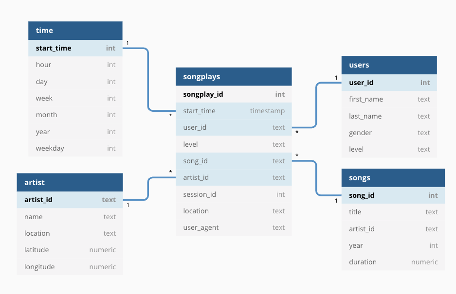

# Data Engineering Nanodegree Data Warehouse Project
In this project, we build a data warehouse for the music streaming startup Sparkify in the cloud.
We implement the data warehouse using AWS services S3 and Reshift.

## Data Model
The final database has the following model:


## Usage
Make sure that `boto3` and `psycopg2` are installed.<br>
Run
```
python create_tables.py # to create the tables
python etl.py # to perform the ETL process
```

